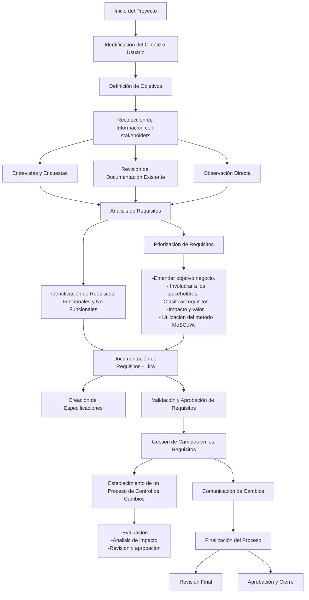

Casos de Prueba
A continuación, te dejo ejemplos de casos de prueba basados en los casos de uso:
Caso de Prueba CP-001: Verificar Registro Completo
•	Objetivo: Verificar que el sistema permita registrar un nuevo producto correctamente.
•	Requerimiento Relacionado: Registro de Nuevos Productos (UC-01).
•	Pasos:
1.	Navegar a la página de registro de productos.
2.	Completar todos los campos obligatorios (nombre, código, cantidad, precio unitario, fecha de ingreso, fecha de vencimiento, descripción).
3.	Presionar el botón "Guardar".
•	Condición Inicial: Sistema sin errores, campos obligatorios en blanco.
•	Resultado Esperado: El producto se registra exitosamente, y el sistema muestra un mensaje de confirmación.

### Plantilla de Gestion de requemientos.

